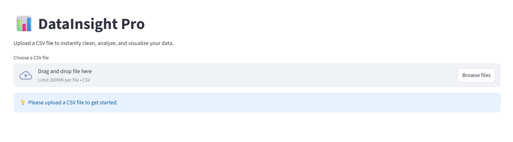
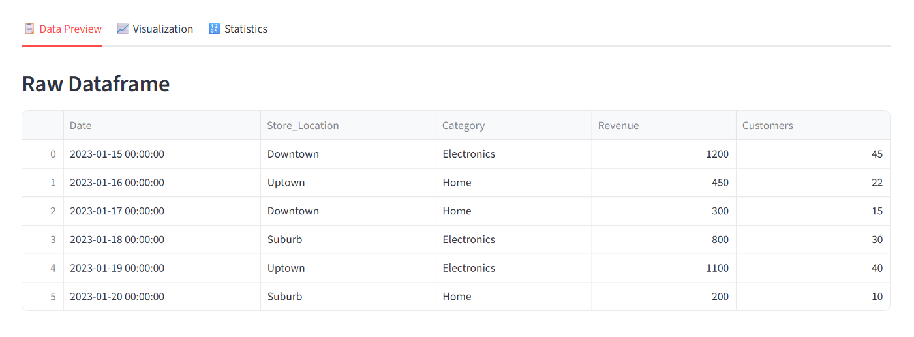
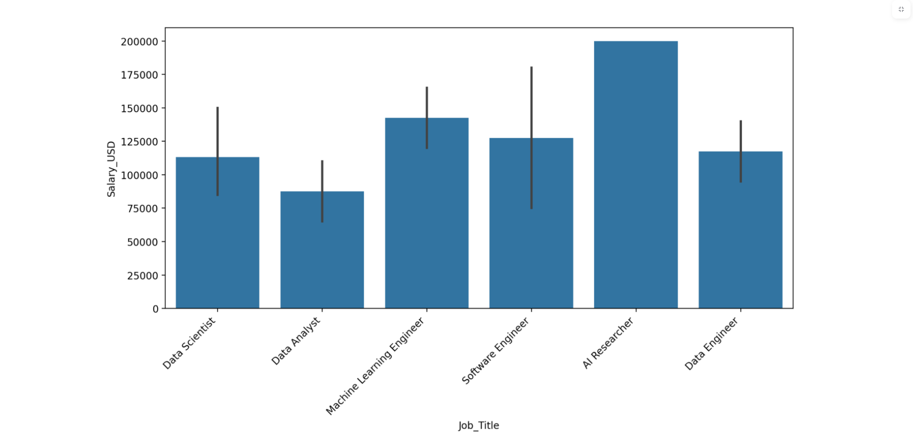
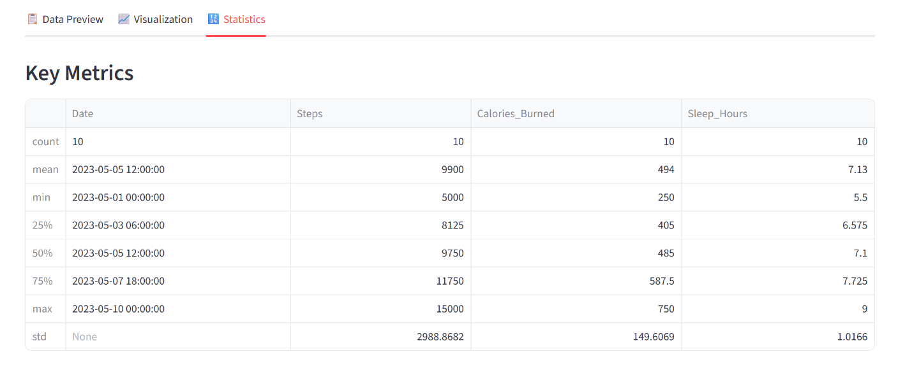

# CSV Data Insight 
An interactive web application for CSV data analysis and data visualization built using Python. Helps turn raw CSV data into visuals and statistics for better understanding. 

# Tech Stack: 
- **Python:** Libraries used include Streamlit, Pandas, Matplotlib, and Seaborn.
- **VS Code**

## Key Features 
- **Smart Data Ingestion:** Drag-and-drop CSV uploader with automatic data type detection.
- **Automated Time-Series Sorting:** Detects date columns and organizes data chronologically for accurate trend analysis.
- **One-Click Data Cleaning:** Built-in logic to handle and remove missing values (NaN) via the sidebar.
- **Dynamic Visualizations:** Generate Bar, Line, and Scatter plots on the fly with optimized label rotation for readability.
- **Statistical Profiling:** Instant generation of key metrics (Mean, Median, Standard Deviation, etc.) using Pandas.
- **Sample Data:** Includes 5 sample CSV files to test the app.

## How to Run Locally

1. **Clone the repository:**
   ```bash
   git clone [https://github.com/your-username/your-repo-name.git](https://github.com/your-username/your-repo-name.git)
   cd your-repo-name

2. **Install dependencies: Ensure you have Python installed, then run:**
   ```bash
   pip install -r requirements.txt

3. **Launch the application:**
   ```bash
   python -m streamlit run app.py


## Sample Images




